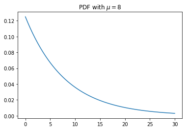

# Exponential Distributions - Lab

## Introduction

In this lesson, we'll make use of our newfound knowledge of the **_Exponential Distribution_** to answer some real-world questions!

## Objectives

You will be able to:

* Understand and explain the Exponential Distribution and its use cases.

## Getting Started

Before we can begin answering questions, it will probably be helpful to write some Python functions to quickly calculate the **PDF** and **CDF** for us.  

For reference, here are the functions we'll want to implement.

### Probability Density Function

$$PDF(x) = \lambda e^{- \lambda x}$$

###   Cumulative Density Function

$$CDF(x) = 1 - e^{- \lambda x}$$

In the cell below, complete the following functions.


```python
import numpy as np

def exp_pdf(mu, x):
    pass
    
def exp_cdf(mu, x):
    pass
```


```python
# __SOLUTION__ 
import numpy as np

def exp_pdf(mu, x):
    decay_rate = 1 / mu
    return decay_rate * np.exp(-decay_rate * x)
    
def exp_cdf(mu, x):
    decay_rate = 1 / mu
    return 1 - np.exp(-decay_rate * x)
```

Great! Now, lets answer some questions.

## Question 1 

Steven is picking up a friend at the airport and their plane is late. The late flight is 22 minutes behind schedule.  What is the probability that Steven will wait 30 minutes or less for his friend's flight to land?


```python
# Expected Output: 0.7442708400868994
```


```python
# __SOLUTION__ 
exp_cdf(22, 30) # Expected Output: 0.7442708400868994
```


    0.7442708400868994


## Question 2

The average student takes 44 minutes to complete a test.  What is the probability that the fastest student in the class will take more than 38 minutes to complete the test?


```python
# Expected Output: 0.4216261054870035
```


```python
# __SOLUTION__ 
1 - exp_cdf(44, 38) # Expected Output: 0.4216261054870035
```


    0.4216261054870035


## Question 3

The first customer of the day walks into a store 6 minutes after the store opens, on average.  What is the probability that a customer shows up within 8 minutes of opening tomorrow?


```python
# Expected Output: 0.7364028618842733
```


```python
# __SOLUTION__ 
exp_cdf(6, 8) # Expected Output: 0.7364028618842733
```


    0.7364028618842733


## Question 4

The average interval that calls come in at a call center is 8 seconds. Plot the probability density function for a call happening at each second between 0 and 30 seconds (you can look at intervals of 0.5 seconds only.


What is the probability that the next call will happen in 7 seconds?


```python
# Create a list to contain the pdf-values

    
# Create the plot


```


```python
# __SOLUTION__ 
# Create a list to contain the pdf-values
seconds = np.linspace(0,30, num = 61)
out= []
for i in seconds:
    out.append(exp_pdf(8,i))

    
# Create the plot
import matplotlib.pyplot as plt
plt.plot(seconds, out)
plt.title("PDF with $\mu = 8$");
```





## Question 5

The average earthquake in a given region happens every 7 weeks.  What is probability that the next earthquake happens between 5 and 8 weeks from now?

**_Hint:_** This has both an upper and lower bound.  You'll need to do some arithmetic to solve this one. 


```python
lower_bound = None
upper_bound  = None

print("Probability of earthquake before 5 weeks: {}%".format(lower_bound * 100))
print("Probability of earthquake before 8 weeks: {}%".format(upper_bound * 100))
print("Probability of earthquake between 5 - 8 weeks: {}%".format((upper_bound - lower_bound) * 100))

# Expected Output: 
# 
# Probability of earthquake before 5 weeks: 51.045834044304684%
# Probability of earthquake before 8 weeks: 68.10934426760295%
# Probability of earthquake between 5 - 8 weeks: 17.063510223298273%
```


```python
# __SOLUTION__ 
lower_bound = exp_cdf(7, 5)
upper_bound  = exp_cdf(7, 8)

print("Probability of earthquake before 5 weeks: {}%".format(lower_bound * 100))
print("Probability of earthquake before 8 weeks: {}%".format(upper_bound * 100))
print("Probability of earthquake between 5 - 8 weeks: {}%".format((upper_bound - lower_bound) * 100))

# Expected Output: 
# 
# Probability of earthquake before 5 weeks: 51.045834044304684%
# Probability of earthquake before 8 weeks: 68.10934426760295%
# Probability of earthquake between 5 - 8 weeks: 17.063510223298273%
```

    Probability of earthquake before 5 weeks: 51.045834044304684%
    Probability of earthquake before 8 weeks: 68.10934426760295%
    Probability of earthquake between 5 - 8 weeks: 17.063510223298273%


## Summary

In this lesson, you solved some real-world problems using the PDF and CDF for the Exponential Distribution!
